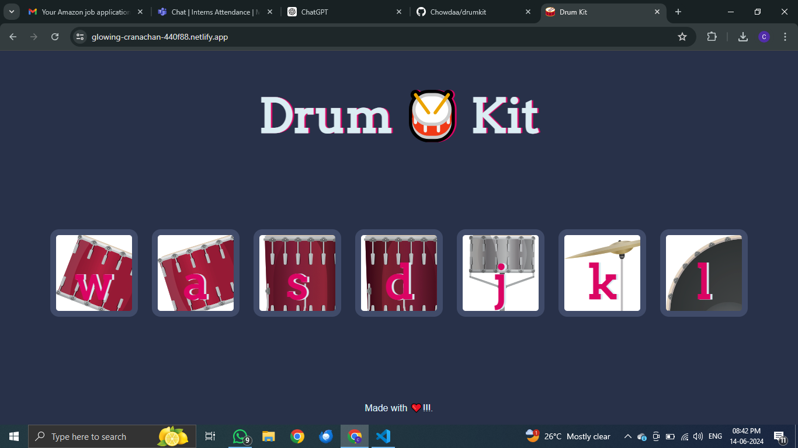

# Drumkit

A simple and interactive drumkit web application.



## Technologies Used

- **HTML**: For structuring the web page.
- **CSS**: For styling the application.
- **JavaScript**: For adding interactivity and handling events.

## Live Demo

Check out the live version of the project [here](https://glowing-cranachan-440f88.netlify.app/).

## Deployment on Netlify

To deploy this project on Netlify, follow these steps:

1. **Create a Netlify Account**: If you don't already have one, go to [Netlify](https://www.netlify.com/) and sign up.
2. **New Site from Git**: Once logged in, click on "New site from Git" on the dashboard.
3. **Connect to GitHub**: Authorize Netlify to access your GitHub account and select the `drumkit` repository.
4. **Build Settings**: For a static site, you usually don't need to change any settings. Just click "Deploy Site."
5. **Deployment**: Netlify will automatically build and deploy your site. Once finished, you will receive a unique URL for your live site.

## Getting Started

To get a local copy of the project up and running, follow these simple steps:

1. **Clone the repo**
   ```sh
   git clone https://github.com/Chowdaa/drumkit.git
   
2. Open index.html in your browser to view the application.
